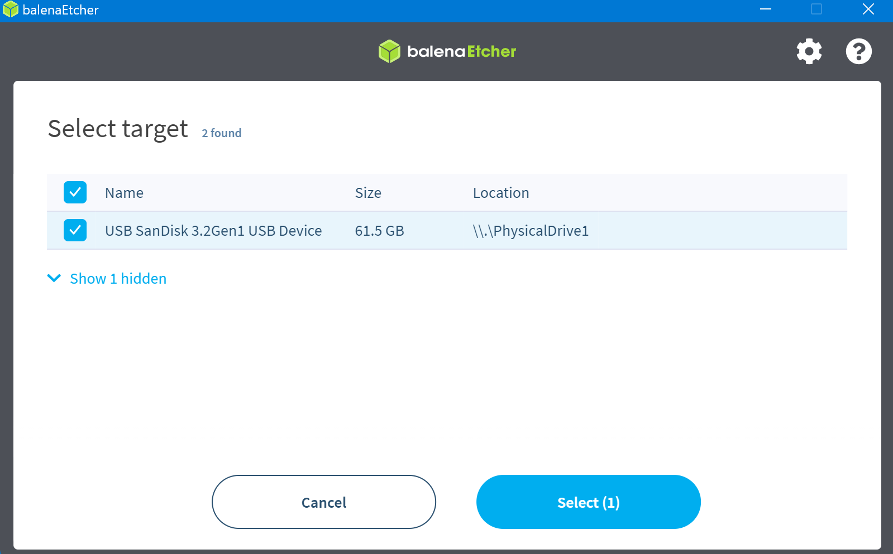
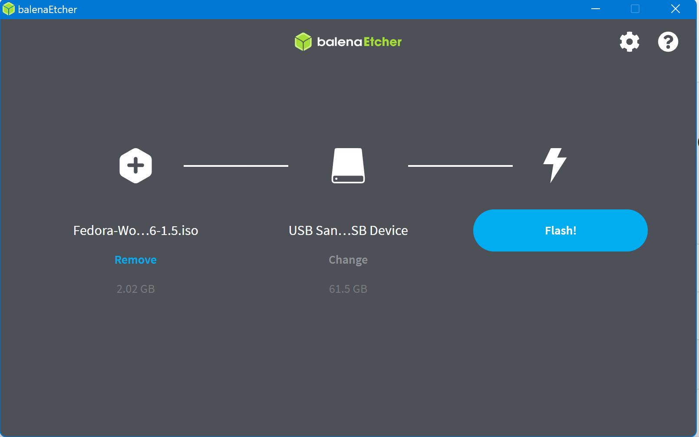
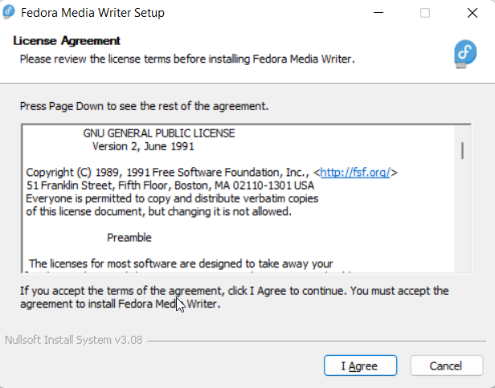
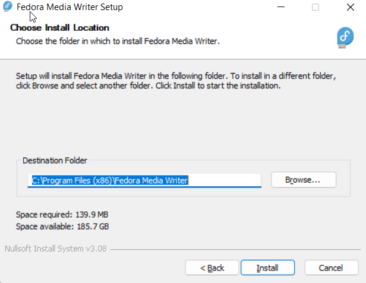

# Namestitev Linux Fedora kot drugi OS

### Prenos Linux Fedora

[Prenos Fedore](https://getfedora.org/en/workstation/download/)

### Ustvarjanje zagonskega USB 
Programi, ki nam omogočajo ustvarjanje zagonskega USB iz ISO datoteke:
* [balenaEtcher](https://www.balena.io/etcher/) 
* [Rufus](https://rufus.ie/en/)
* [Fedora Media Writer](https://getfedora.org/en/workstation/download/)

balenaEtcher je sicer priporočena s strani Fedore. Njen uporabniški vmesnik je preprost in enostaven za uporabo. Rufus je enako orodje .

## balenaEtcher

Izbira .iso datoteke

Izbira USB ključka

**Flash!**

## Rufus

* Select - Izbira ISO slike
* Volume Label - Ime USB ključka
* START - Začetek procesa

## Fedora Media Writer

## Ustvarjanje nove zagonske naprave

Dve možnosti:
* ISO Slika Fedora Linux
* Avtomatski prenos iz spleta

### Dodatna informacija:

Ustvarjen usb na windows računalniku ne bo prikazan. Tudi če imamo orodje, ga najverjetneje ne bo pravilno prebralo. USB sicer dela.

## Zagon iz USB
Ko imamo bootable USB, je naslednji korak izbira zagonske naprave. Pri tem je pomembno, da imamo USB ključ vstavljen v računalnik, preden ga ponovno zaženemo.
Katera tipka nas pripelje v Boot Menu je odvisno od modela - Google it.

Nadaljni proces je enak kot pri namestitvi v VM.
[Podrobna navodila za install Fedore](./Fedora.md)