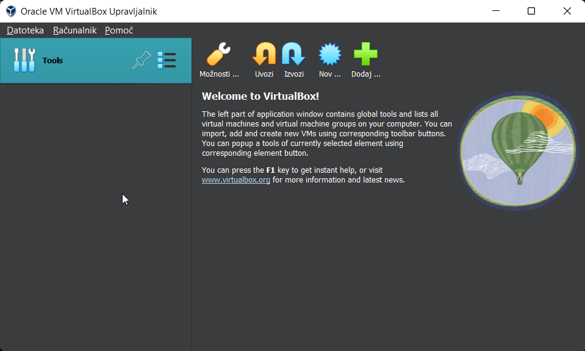
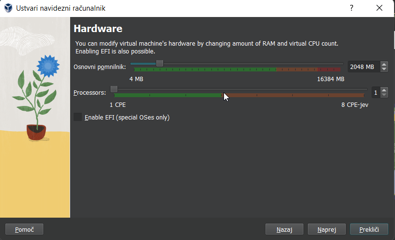
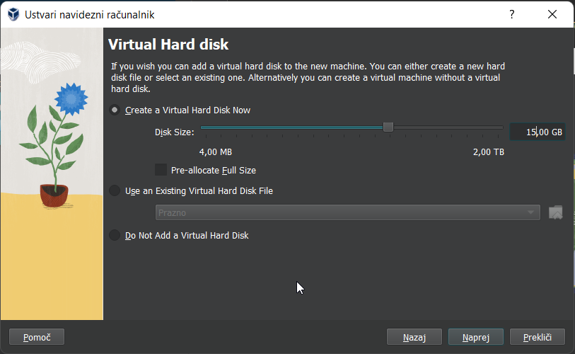
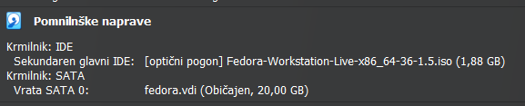
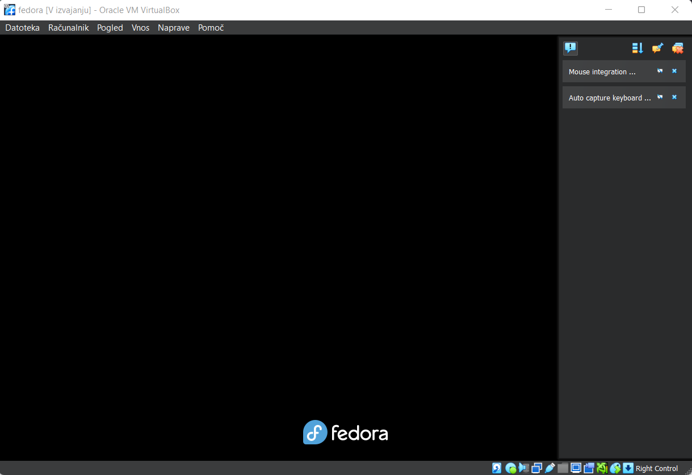
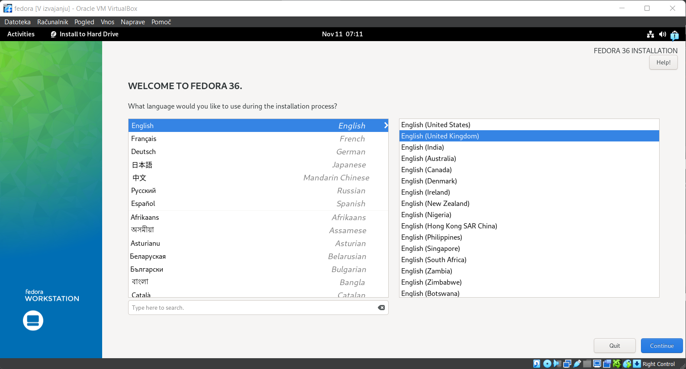
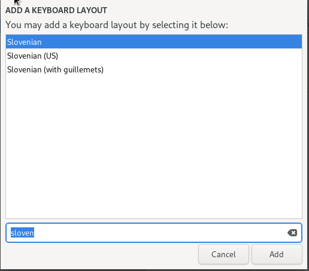
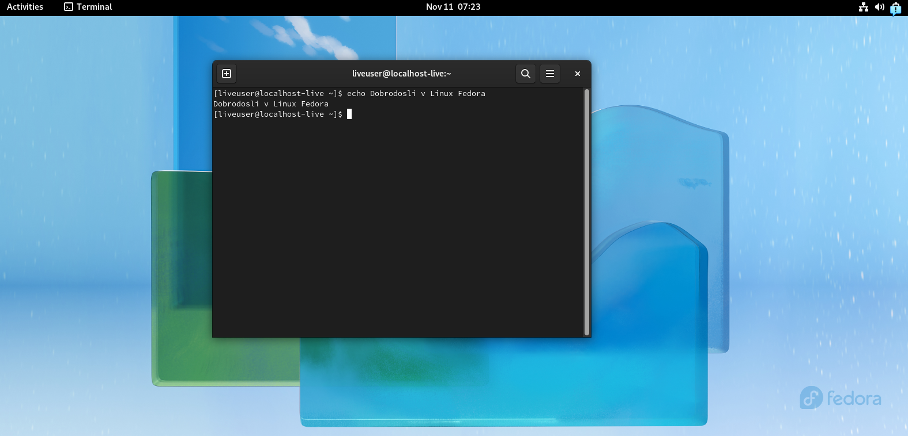

# Namestitev Linux Fedora v VM

### Prenos Linux Fedora

[Prenos Fedore](https://getfedora.org/en/workstation/download/)

## Ustvarjanje nove navidezne naprave
Pogoj: ISO Slika Fedora Linux

## Inštalacija Linux Fedora

Priporočeno je 3GB RAM-a, 2 jedra procesorja in 20GB prostora za disk.
Privzeto je **desni control** za konec zajema miške in tipkovnice.

**Vidimo, da je namestitev uspela.**

Za zaustavitev računalnika obstaja več načinov. Eden izmed njih je pritisk tipke right-ctrl (desni control) in kar X na vrhnji vrstici.

Pomembno je, da pošljemo "signal za zaustavitev" računalnika, saj se sicer lahko zgodi, da se računalnik ne zaustavi pravilno.
