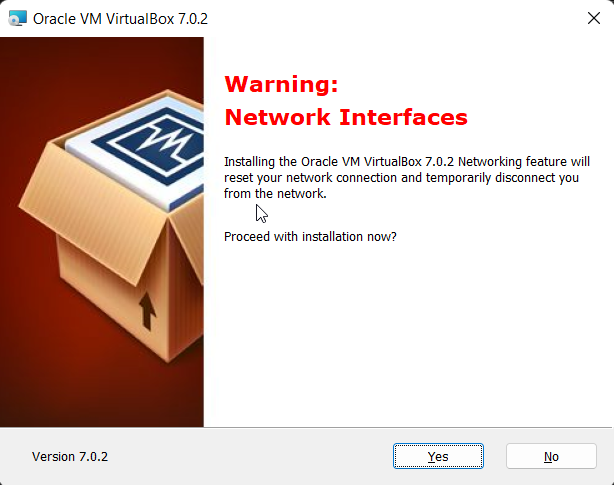
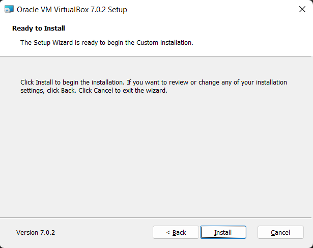
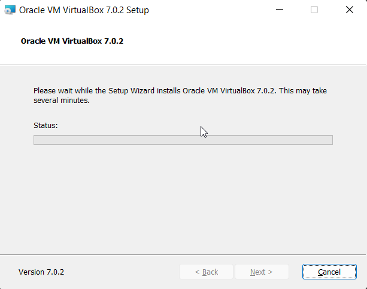

# Namestitev VirtualBox

### Windows
[Povezava za prenos](https://www.virtualbox.org/wiki/Downloads), kjer izberemo **Windows hosts**. 

Datoteko 'VirtualBox-x.x.x-Win.exe' shranimo na računalnik in jo zaženemo.

 
